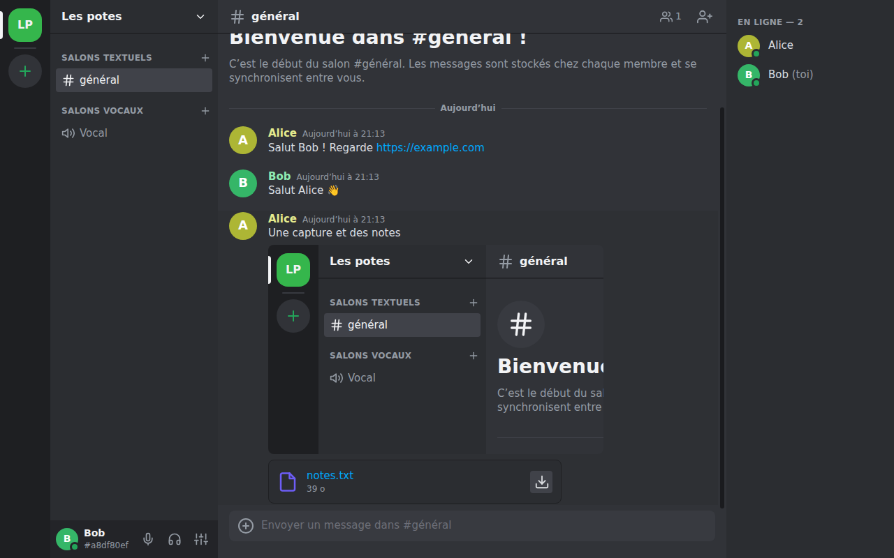
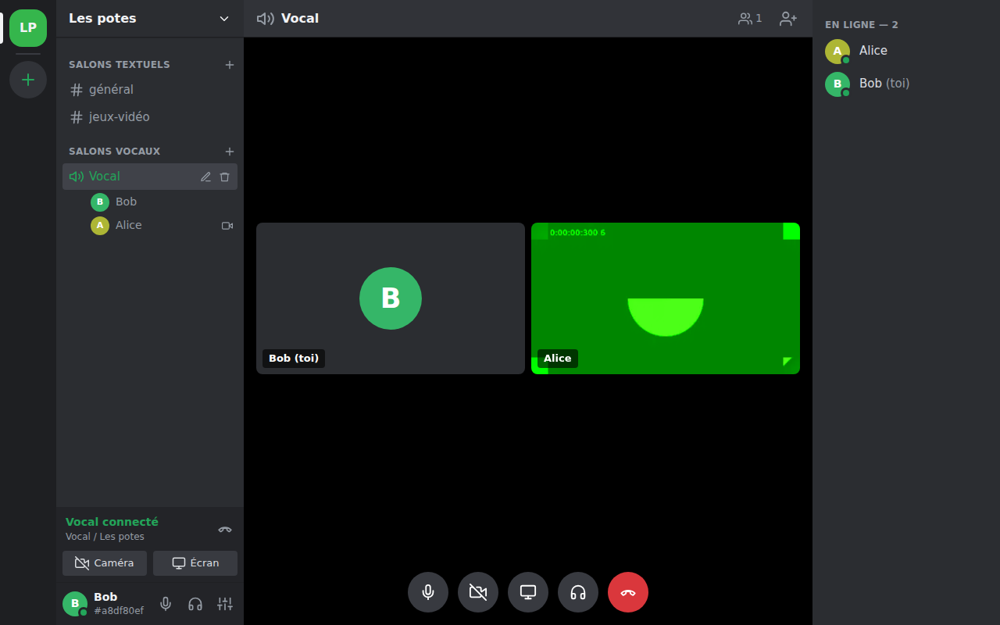
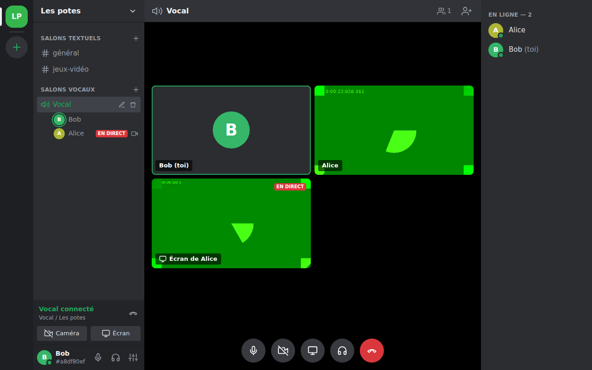

# Dixcord

Un Discord maison, **100 % pair-à-pair** : pas de serveur à héberger, juste des clients qui se parlent directement.



## Fonctionnalités

- **Serveurs** privés, rejoints avec un code d'invitation.
- **Salons textuels** : messages en temps réel, liens cliquables, historique.
- **Fichiers et images** : glisser-déposer, copier-coller, aperçu des images et vidéos.
- **Salons vocaux** : voix, **caméra** et **partage d'écran**.
- **Historique synchronisé entre membres** : en revenant en ligne, tu récupères ce que tu as manqué auprès de n'importe quel membre connecté.
- Créer, renommer et supprimer des salons, renommer le serveur, changer de pseudo, choisir micro, caméra et sortie audio.

| Vocal + caméra | Partage d'écran |
| --- | --- |
|  |  |

## Installation

### Windows : télécharger le .exe (le plus simple)

Va dans la page [**Releases**](https://github.com/CapitaineMax9/dixcord/releases) du dépôt et télécharge, dans la dernière version :

- `Dixcord-Setup-x.y.z.exe` : **installateur**. Un double-clic installe Dixcord, sans droits administrateur, et crée un raccourci sur le bureau et dans le menu Démarrer.
- ou `Dixcord-x.y.z-portable.exe` : **version portable**. Elle se lance directement, sans installation (pratique sur une clé USB).

> Au premier lancement, Windows peut afficher « Windows a protégé votre ordinateur » : l'application n'est pas signée par un certificat payant. Clique sur **Informations complémentaires**, puis **Exécuter quand même**. Si le pare-feu demande l'autorisation, clique sur **Autoriser** : sans ça, les connexions directes échouent.

### Depuis le code source (Windows, macOS, Linux)

Il faut [Node.js](https://nodejs.org) 20 ou plus récent.

```bash
git clone https://github.com/CapitaineMax9/dixcord.git
cd dixcord
npm install
npm start
```

### Publier une nouvelle version

1. Sur GitHub : **Releases**, puis **Draft a new release**.
2. Dans **Choose a tag**, tape un nouveau tag de la forme `v1.2.3` (par exemple `v0.1.0`, puis `v0.2.0`…) et choisis « Create new tag on publish ».
3. Donne un titre, puis clique sur **Publish release**.

Le workflow GitHub Actions [`release.yml`](.github/workflows/release.yml) se lance tout seul sur une machine Windows. Il exécute les tests, fabrique les deux `.exe` et les attache à la release. Compte une dizaine de minutes, et suis l'avancement dans l'onglet **Actions**.

Pour fabriquer les `.exe` toi-même sur un PC Windows : `npm run dist:win` (résultat dans `dist/`).

## Utilisation

1. Au premier lancement, choisis un pseudo.
2. **Créer un serveur** : clique sur `+` dans la barre de gauche. Le code d'invitation s'affiche aussitôt.
3. Envoie ce code à tes amis (SMS, mail…). Ils cliquent sur `+`, puis **Rejoindre un serveur**, et le collent.
4. Les applications se trouvent toutes seules sur Internet, en quelques secondes.
5. Clique sur un salon vocal pour y entrer, puis active la caméra ou le partage d'écran depuis la barre du bas.

> ⚠️ Le code d'invitation **est la clé du serveur** : toute personne qui l'a peut rejoindre le serveur et lire tout l'historique. Ne le partage qu'avec des personnes de confiance.

### Tester à plusieurs sur un seul ordinateur

Chaque profil a ses propres données et sa propre identité :

```bash
npm start -- --profile=alice
npm start -- --profile=bob
```

## Comment ça marche sans serveur ?

```
  Alice ─────────────── Bob          1. Se trouver : DHT publique Hyperswarm
    │  ╲               ╱  │          2. Se connecter : connexion chiffrée directe (Noise),
    │    ╲           ╱    │             perçage des box/NAT
    │      ╲       ╱      │          3. Prouver qu'on est membre (sans montrer la clé)
  Carol ─────────────── Dave         4. Synchroniser l'historique signé, relayer
                                        les messages, transférer les fichiers
     chacun relié à chacun           5. Vocal/vidéo : WebRTC, directement entre membres
```

1. **Se trouver.** Chaque serveur a un secret aléatoire de 32 octets, contenu dans le code d'invitation. On en dérive un « sujet ». Chaque membre s'annonce sur la [DHT Hyperswarm](https://github.com/holepunchto/hyperswarm), un annuaire réparti entre des milliers de machines, puis cherche les autres membres qui s'annoncent sur le même sujet.
2. **Se connecter.** Hyperswarm établit une connexion chiffrée de bout en bout (protocole Noise) directement entre les deux ordinateurs, et sait percer la plupart des box et des NAT.
3. **S'authentifier.** Connaître le sujet ne suffit pas : chaque pair doit prouver qu'il connaît le secret du serveur. Il envoie un HMAC lié à la session chiffrée, impossible à rejouer ou à renvoyer. Sans cette preuve, on ne lui envoie rien.
4. **Historique.** Tout ce qui est partagé (messages, salons, nom du serveur, pseudos) est un **événement signé** (Ed25519) par son auteur et numéroté (1, 2, 3…). Chaque membre garde tout l'historique sur son disque. À chaque connexion, et toutes les 30 secondes, deux pairs comparent ce qu'ils ont (« j'ai les messages 1 à 42 d'Alice… ») et s'envoient ce qui manque. Comme tout est signé, un membre peut relayer les messages d'un autre **sans pouvoir les falsifier**.
5. **Fichiers.** Ils sont identifiés par leur empreinte SHA-256, envoyés par morceaux depuis n'importe quel membre qui les possède, et vérifiés à l'arrivée.
6. **Vocal, vidéo, écran.** Ils passent en WebRTC, en maillage complet (chaque participant est relié à chacun des autres). Les échanges nécessaires pour établir ces liaisons passent par les connexions Hyperswarm déjà ouvertes : aucun serveur de signalisation.

### Ce qui reste « public »

Aucun serveur ne t'appartient, mais l'application s'appuie sur une infrastructure publique et gratuite, qui ne voit jamais le contenu de vos échanges :

- les **nœuds d'amorçage** de la DHT Hyperswarm, qui servent de point d'entrée dans l'annuaire ;
- des **serveurs STUN** publics (Google, Cloudflare), qui aident WebRTC à découvrir ton adresse publique pour le vocal.

Si le vocal ne passe pas chez certains amis (réseaux très fermés, 4G/5G avec CGNAT), tu peux ajouter un serveur **TURN** dans `settings.json`, dans le dossier de données ci-dessous :

```json
{
  "iceServers": [
    { "urls": "stun:stun.l.google.com:19302" },
    { "urls": "turn:mon-serveur-turn.exemple:3478", "username": "moi", "credential": "secret" }
  ]
}
```

## Limites à connaître

- **Connexion en quelques secondes.** Après le lancement de l'application (ou une coupure réseau), retrouver les autres membres prend en général de quelques secondes à une quinzaine de secondes. Un appel en cours résiste à une coupure passagère du lien entre deux membres.
- **Il faut être en ligne en même temps.** Un message écrit quand personne d'autre n'est connecté part dès qu'un autre membre se connecte en même temps que toi. Il peut aussi passer par un tiers qui l'a déjà reçu.
- **Fichiers.** Un fichier n'est téléchargeable que si un membre qui le possède est en ligne. Les images et vidéos de moins de 8 Mo sont récupérées automatiquement. Taille maximale : 100 Mo.
- **Pas de modération.** Tous les membres ont les mêmes droits : renommer ou supprimer un salon, renommer le serveur. On ne peut pas expulser quelqu'un ni révoquer un code d'invitation. Pour « changer la serrure », crée un nouveau serveur.
- **Vocal en maillage.** Idéal jusqu'à 5 à 8 personnes : au-delà, chacun envoie son flux à tous les autres et la bande passante montante sature.
- **Réseaux très restrictifs.** Sur certains réseaux (NAT symétriques, pare-feu d'entreprise), la connexion directe peut échouer.
- L'ordre des messages suit l'horloge de leur auteur.
- Les données sont stockées en clair sur ton disque, comme pour la plupart des messageries de bureau.

## Données locales

Tout est dans le dossier de données de l'application :

| Système | Dossier |
| --- | --- |
| Windows | `%APPDATA%\dixcord` |
| macOS | `~/Library/Application Support/dixcord` |
| Linux | `~/.config/dixcord` |

- `data/identity.json` : ta **clé secrète** (ton identité) et ton pseudo. Ne la partage jamais.
- `data/servers.json` : les secrets des serveurs que tu as rejoints.
- `data/servers/<id>/events.jsonl` : l'historique de chaque serveur.
- `data/files/` : les pièces jointes, rangées par empreinte.
- `settings.json` : réglages réseau (serveurs STUN/TURN).

## Développement

```
src/
  core/         Le cœur pair-à-pair, en Node.js pur (testable sans Electron)
    node.js       Nœud Dixcord : connexions, authentification, synchro, fichiers, vocal
    events.js     Événements signés et leur validation
    store.js      Historique local d'un serveur
    files.js      Stockage des fichiers par empreinte
    framing.js    Découpage du flux réseau en trames
    invite.js     Codes d'invitation
  main/         Processus principal Electron (fenêtre, IPC, protocole dxc://)
  renderer/     Interface (HTML/CSS/JS sans framework) et gestion WebRTC (voice.js)
test/           Tests unitaires et d'intégration (vrais pairs sur une DHT locale)
test/e2e/       Test de bout en bout : deux applications pilotées par Playwright
```

```bash
npm test            # tests unitaires et d'intégration réseau (quelques secondes)
npm run test:e2e    # deux vraies fenêtres qui discutent, s'appellent et partagent leur écran
                    # (Linux sans écran : xvfb-run -s "-screen 0 1920x1080x24" npm run test:e2e)
DIXCORD_DEBUG=1 npm start   # affiche connexions et déconnexions dans le terminal
```

Le test de bout en bout fait tourner deux instances sur la même machine, avec une DHT locale. Il peut échouer de temps en temps si Hyperswarm met plus d'une minute à reconnecter les deux instances : relance-le. Le partage d'écran n'y est vérifié que si le système fournit une source de capture.

### Protocole

Sur chaque connexion Hyperswarm, les trames sont de la forme `[longueur][en-tête JSON][données binaires]` :

| Trame | Rôle |
| --- | --- |
| `hello` | pseudo + preuves d'appartenance aux serveurs |
| `join` | preuve pour un serveur rejoint après la connexion |
| `sync` / `evs` | « voici ce que j'ai » / « voici ce qui te manque » |
| `ev` | nouvel événement en direct (relayé aux autres) |
| `voice` | état vocal (salon, micro coupé, caméra, écran) |
| `rtc` | signalisation WebRTC |
| `fget` / `fdata` / `fend` / `fnone` | transfert de fichiers |

## Idées pour la suite

- Versions macOS (`.dmg`) et Linux (AppImage) dans les releases.
- Messages privés, réponses, réactions, mentions, modification et suppression de messages.
- Rôles et modération (signatures d'un propriétaire), rotation du secret du serveur.
- Chiffrement des données locales.
